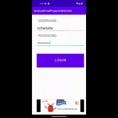
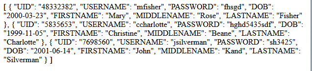
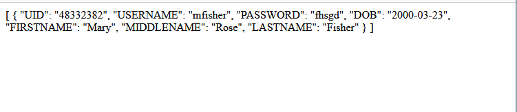

# cmsc436grproj  

  

# CMSC436 Group Final Project
Welcome to our Final Project for CMSC436 Spring 2023.
This project is supposed to be private, and not visible unless logged into github, and also a member of this repo.
Please email one of the contributors below if this project is public

# setup
## First setup password less authentication with github  
### On windows  
On windows navigate to your home directory.
```
cd %HOMEPATH%
```  
Create the `.ssh` folder if it does not exists.  

```
mkdir .ssh
cd .ssh
```  

Create a new key if you do not have one.  

```
ssh-keygen -t rsa -b 4096 -C "user@email.com"
```  

view the content of the public key just created( in this case the key name is id_rsa)
```
type id_rsa.pub
```  

Add key to ssh agent. Hoepflly you are in the `.ssh` folder
```
ssh-add .\id_rsa
ssh-copy-id .\id_rsa
```  

### On Linux/MAC
```
cd ~
```  
Create the `.ssh` folder if it does not exists.  

```
mkdir .ssh
cd .ssh
```  

Create a new key if you do not have one.  

```
ssh-keygen -t rsa -b 4096 -C "user@email.com"
```  

view the content of the public key just created( in this case the key name is id_rsa)
```
cat id_rsa.pub
```  

Add key to ssh agent
```
ssh-add ~/.ssh/id_rsa
ssh-copy-id ~/.ssh/id_rsa
eval "$(ssh-agent -s)"
```

### Clone This Repo
Then clone this repo by running on the command line:
```
git clone git@github.com:ntuifranklin/cmsc436grproj.git
```
The [`androidui`](https://github.com/ntuifranklin/cmsc436grproj/tree/main/androidui) folder is an android app setup to run automatically without any other further installation required.

# Server Setup
The server needs to have `wamp` or `xamp` server setup.
The [./sql/flush_and_reload_tables.sql](./sql/flush_and_reload_tables.sql) contains the sql queries to create the database on server side from scratch.  
The only manual thing to do is to create the user `fnkokamn_dbadmin` with password `AV7y8JFAnSrkyzy`.  
The [`grant mysql query`](https://dev.mysql.com/doc/refman/8.0/en/grant.html) also needs to be run to grant the new creaed user privileges to run queries on the backend. 
The following parameters need to be set server side for the android app to run properly 
```
$servername = "localhost" ;
$username = "fnkokamn_dbadmin";
$password = "AV7y8JFAnSrkyzy"; 
$database = "fnkokamn_terpdb";
```

# Backend calls
Format : `http://server.domain/backend.php?action=action_name&param1=value1&param_i=value_i`
`server.domain` is supposed to be [`s56.cmsc436-2301.cs.umd.edu/server`](https://s56.cmsc436-2301.cs.umd.edu/server). For some reason the firewall might block access in android. 
The examples below use an aws free instance running at [`https://s56.cmsc436-2301.cs.umd.edu/server`](https://s56.cmsc436-2301.cs.umd.edu/server/).   

Example of backedn call actions (value that the URL_LINK in android is supposed to take) :
- List all students 
 [https://s56.cmsc436-2301.cs.umd.edu/server/backend.php?action=users](https://s56.cmsc436-2301.cs.umd.edu/server/backend.php?action=users).  
 This should produce a screen shot that looks like the image below : 
 .  
- List one student
[https://s56.cmsc436-2301.cs.umd.edu/server/backend.php?action=user&username=mfisher&password=fhsgd](https://s56.cmsc436-2301.cs.umd.edu/server/backend.php?action=user&username=mfisher&password=fhsgd).  
 
- List a Course  
Need the `courseid` and `coursetitle` parameters in the url:  
[`List CMSC131`](https://s56.cmsc436-2301.cs.umd.edu/server/backend.php?action=course&courseid=CMSC131)
- List all courses
[`List CMSC131`](https://s56.cmsc436-2301.cs.umd.edu/server/backend.php?action=courses)

# Important Links 
- [Google Drive](https://drive.google.com/drive/folders/1S7O9GnaQ03TETIQG_aGKG_-kH0UECRlk)
- [Discord Channel](https://discord.com/channels/1088169035402846349/)
- [Our Zoom meeting](https://umd.zoom.us/j/3773753652)
- [Project Description](https://drive.google.com/file/d/1IuR6Oc_YbCJ_7MTXSxKA6H6RYk8fBHRP/view?usp=share_link)

# Contributors
- [Gloria Hyein Leem](#contributors-by-alphaebetical-order)
- [Ian Yeh](https://github.com/ilyeh)
- [Jacob Cuff](https://github.com/jcuff1)
- [Franklin Ngongang](https://github.com/ntuifranklin)

# Potential Errors  
When you `git fetch` or `git pull` from the main branch, the newly added google ad code might  
not work if you did not rebuild after addition of google ad api key. To fix :
- [Stack Overflow Issue here](https://stackoverflow.com/questions/52458939/can-not-resolve-com-google-android-gms-ads-mobileads).  
Sometimes `s#.*.cs.umd.edu` might not work. In `MainActivity.kt` file, in the companion object section, activate the AWS urls  :
[http://ec2-54-196-231-193.compute-1.amazonaws.com/cmsc436grproj/](http://ec2-54-196-231-193.compute-1.amazonaws.com/cmsc436grproj/)
by commenting or un commenting the appropriate urls
# References

- [Generate a new ssh key and adding it to the ssh-agent](https://docs.github.com/en/authentication/connecting-to-github-with-ssh/generating-a-new-ssh-key-and-adding-it-to-the-ssh-agent)
- [Adding a new SSH key to your GitHub account](https://docs.github.com/en/authentication/connecting-to-github-with-ssh/adding-a-new-ssh-key-to-your-github-account?platform=linux)
- [Test the ssh connection to github](https://docs.github.com/en/authentication/connecting-to-github-with-ssh/testing-your-ssh-connection)
